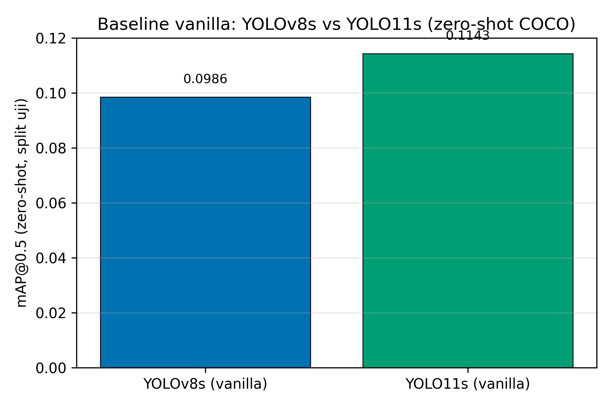
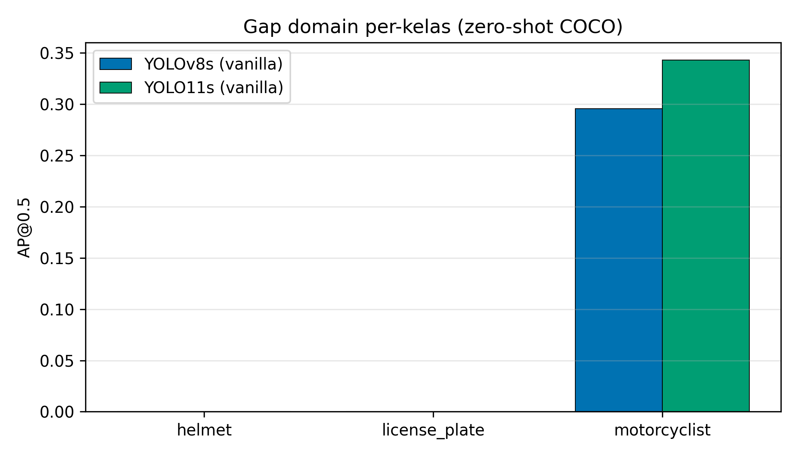
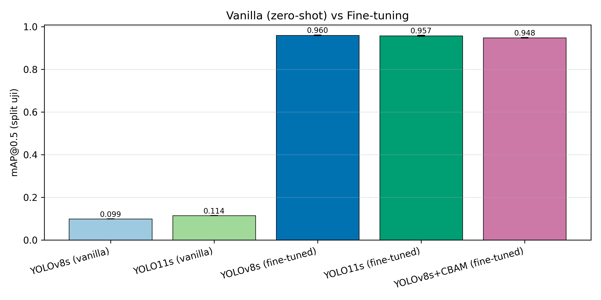
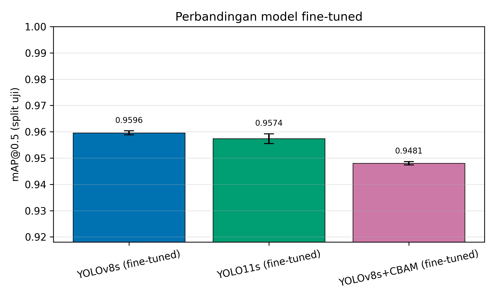
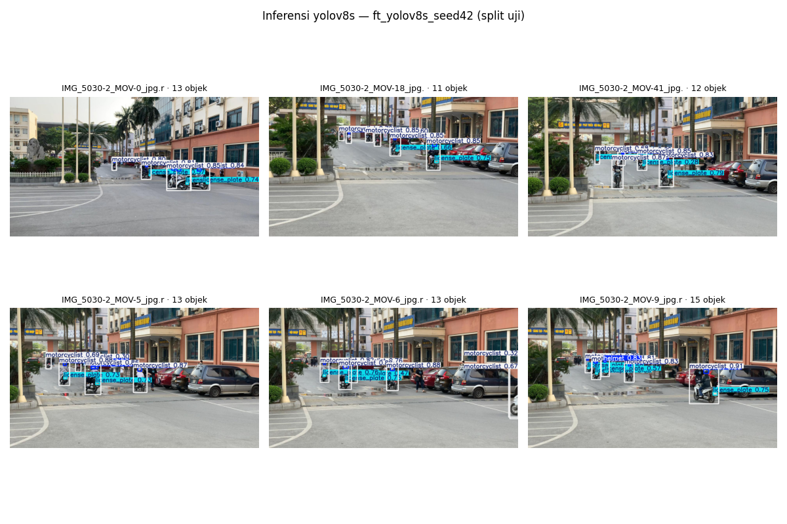
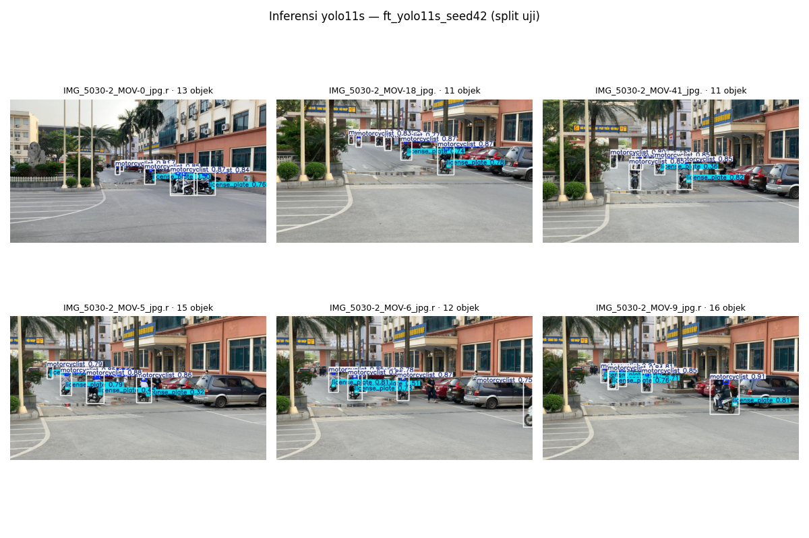
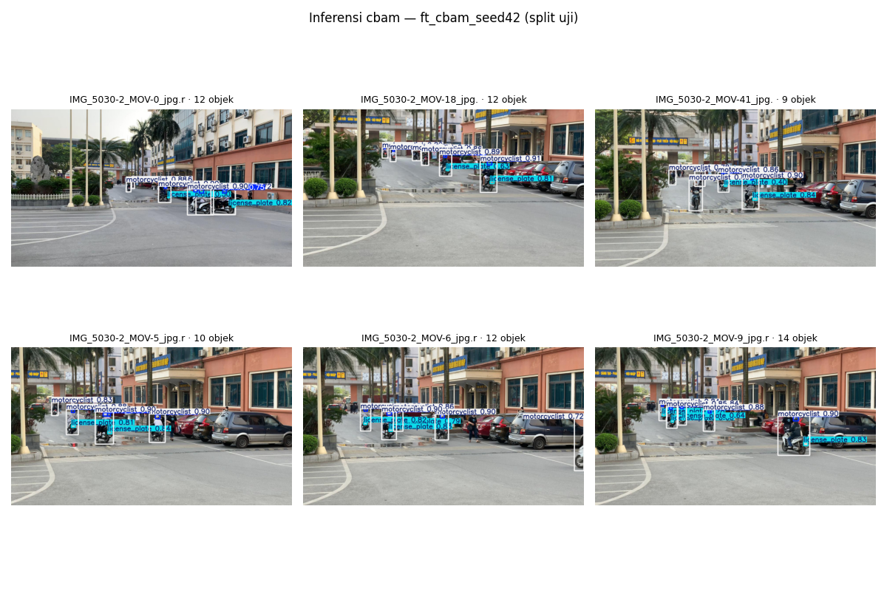

# Dari Zero-shot ke Fine-tuning: Mengukur Gap Domain dan Peran Atensi pada Deteksi Helm Pengendara Sepeda Motor

*Draf revisi v2. Format IMRaD, sitasi IEEE, Bahasa Indonesia. Angka eksperimen bersumber dari `experiments/*/metrics.json`; figur dari `results/figures/`.*

---

## Abstrak

Penggunaan helm adalah faktor protektif utama bagi pengendara sepeda motor, dan deteksi otomatis kepatuhannya dari kamera lalu lintas dapat menopang penegakan keselamatan jalan. Dua asumsi kerap muncul dalam praktik: bahwa bobot pra-latih COCO dapat langsung dipakai pada domain helm, dan bahwa menambahkan mekanisme atensi meningkatkan akurasi. Studi ini menguji keduanya secara terkendali pada dataset publik NCKH 2023 v19 (1.803 citra; tiga kelas: *helmet*, *license_plate*, *motorcyclist*). Sebagai sanity-check dan motivasi, kami terlebih dahulu memverifikasi besarnya gap domain melalui evaluasi *zero-shot* bobot COCO apa adanya (YOLOv8s dan YOLO11s) dengan `pycocotools`. Tahap ini tidak dimaksudkan sebagai perbandingan arsitektur, melainkan untuk mengkonfirmasi perlunya fine-tuning. Kontribusi utama studi ini adalah evaluasi terkendali multi-*seed* (n = 3) atas tiga arsitektur setelah fine-tuning identik, yaitu YOLOv8s (CNN murni), YOLO11s (atensi parsial C2PSA), dan YOLOv8s+CBAM (atensi *channel-spatial* eksplisit), dilengkapi uji-t berpasangan dan *effect size*. Hasil *zero-shot* mengkonfirmasi gap domain besar: mAP@0.5 hanya 0,0986 hingga 0,1143, dengan kelas `helmet` dan `license_plate` bernilai nol *by design* (tak ada padanan di COCO). Setelah fine-tuning, akurasi melonjak ke sekitar 0,96 mAP@0.5. Di antara model fine-tuned, tidak ada varian ber-atensi yang melampaui CNN murni pada mAP@0.5: YOLOv8s mencapai 0,9596 ± 0,0008, YOLO11s 0,9574 ± 0,0019, dan YOLOv8s+CBAM 0,9481 ± 0,0006. Pada metrik yang lebih ketat, mAP@[.5:.95], urutannya justru berbalik: YOLO11s (0,6902 ± 0,0022) sedikit melampaui YOLOv8s (0,6885 ± 0,0006), meski selisihnya tidak signifikan (t(2) = −1,16; p = 0,37). Penambahan CBAM menurunkan mAP@0.5 secara signifikan (t(2) = 16,1; p = 0,004; Cohen's *d* ≈ 9,3). Temuan terakhir ini terbatas pada satu konfigurasi penempatan dan satu *learning rate*, sehingga tidak dapat digeneralisasi ke semua implementasi CBAM. Dengan n = 3 dan efek langit-langit di sekitar 0,96, daya statistik untuk mendeteksi perbedaan kecil sangat terbatas. Temuan ini lebih tepat dibaca sebagai bukti bahwa pada pengaturan yang diuji, tidak ada keuntungan konsisten dari atensi tambahan.

**Kata kunci:** deteksi helm; deteksi objek; YOLO; mekanisme atensi; CBAM; transfer learning; gap domain; mAP.

---

## I. Pendahuluan

Sepeda motor menyumbang proporsi besar korban kecelakaan lalu lintas, khususnya di negara berkembang tempat moda ini mendominasi mobilitas harian. Helm adalah faktor protektif paling menentukan terhadap cedera kepala fatal, sehingga pemantauan kepatuhan penggunaan helm menjadi sasaran penting kebijakan keselamatan. Pengamatan manual tidak terskala untuk volume lalu lintas nyata, sehingga deteksi objek otomatis dari rekaman kamera menawarkan jalan keluar yang dapat berjalan terus-menerus dan konsisten [1], [2].

Selama satu dekade terakhir, deteksi objek bergeser dari pendekatan dua-tahap yang akurat namun lambat ke detektor satu-tahap yang cepat, dengan keluarga YOLO sebagai standar de-facto untuk aplikasi waktu-nyata [5], [6]. Secara paralel, mekanisme atensi yang lahir dari Transformer [10] dan diadaptasi ke citra melalui Vision Transformer [11] mengubah peta arsitektur. Detektor berbasis Transformer seperti DETR [8] dan turunan waktu-nyatanya RT-DETR [7] bersaing dengan CNN, sementara modul atensi ringan seperti Squeeze-and-Excitation [12] dan CBAM [9] menjadi cara populer menyisipkan atensi ke dalam *backbone* CNN yang sudah ada.

Penambahan atensi pada model deteksi helm telah menghasilkan sejumlah laporan positif. Zhang dkk. [19] melaporkan bahwa penyisipan modul atensi dan *feature fusion* pada YOLOv8 meningkatkan deteksi helm; Li dkk. [20] menunjukkan peningkatan serupa pada YOLOv5s; dan Jia dkk. [22] mendemonstrasikan perbaikan dengan *deformable attention*. Perlu dicatat bahwa studi-studi tersebut dijalankan pada dataset, arsitektur dasar, dan protokol pelatihan yang berbeda dari studi ini. Temuan mereka tidak dimaksudkan untuk dibantah secara langsung, melainkan menjadi konteks yang memotivasi perlunya evaluasi terkendali. Laporan-laporan itu umumnya membandingkan satu varian model tanpa pengulangan antar-*seed*, tanpa protokol pelatihan yang diseragamkan, dan tanpa uji signifikansi. Akibatnya, selisih yang dilaporkan bisa berasal dari hyperparameter, augmentasi, atau keberuntungan inisialisasi, bukan dari atensi itu sendiri.

Selain asumsi tentang atensi, ada asumsi kedua yang jarang diverifikasi: bahwa bobot pra-latih COCO sudah cukup dekat dengan tugas helm. Skema kelas helm (`helmet`, `license_plate`, `motorcyclist`) hanya beririsan sebagian dengan 80 kelas COCO [14], dan dua dari tiga kelas tidak memiliki padanan sama sekali. Besarnya gap domain ini perlu diverifikasi, bukan diasumsikan, agar implikasi deployment dapat dinilai dengan tepat.

Studi ini menutup kedua celah tersebut. Kontribusi metodologis utamanya terletak pada rancangan evaluasi yang terkendali, bukan pada kesimpulan bahwa atensi buruk. Rancangan tersebut mencakup protokol identik, pengulangan multi-*seed*, uji statistik formal, serta pemisahan antara gap domain (tahap *zero-shot*) dan efek atensi (tahap fine-tuning). Dua pertanyaan riset terfokus:

- **RQ1.** Seberapa besar gap domain antara bobot COCO apa adanya dan tugas deteksi helm?
- **RQ2.** Setelah fine-tuning dengan protokol identik dan pengulangan multi-*seed*, apakah mekanisme atensi (C2PSA pada YOLO11s, CBAM pada YOLOv8s) melampaui CNN murni YOLOv8s secara statistik bermakna?

Kontribusi utama paper ini ada tiga. Pertama, verifikasi gap domain melalui baseline *vanilla* (zero-shot COCO) yang dievaluasi dengan `pycocotools` sebagai sanity-check, termasuk pengakuan bahwa dua dari tiga kelas bernilai nol *by design* sehingga mAP agregat tidak mencerminkan kemampuan deteksi helm langsung. Kedua, evaluasi terkendali multi-*seed* (n = 3) antara CNN murni, atensi parsial, dan atensi eksplisit di bawah hyperparameter, data, dan augmentasi identik, dilengkapi uji-t berpasangan, *effect size* Cohen's *d*, dan selang kepercayaan, pada kedua metrik mAP@0.5 dan mAP@[.5:.95]. Ketiga, pipeline reproducible berbasis notebook dengan *seed* tetap, lingkungan tercatat, dan metrik satu sumber kebenaran, sehingga seluruh angka dapat ditelusuri dan diulang.

## II. Tinjauan Pustaka

### A. Deteksi penggunaan helm

Penelitian deteksi helm berkembang dari klasifikasi sederhana menuju pipeline yang melacak motor antar-bingkai dan membedakan pengemudi dari penumpang. Siebert dan Lin [1] mendemonstrasikan deteksi penggunaan helm skala besar dari video lalu lintas menggunakan *deep learning* dan merilis dataset beranotasi yang menjadi rujukan komunitas. Lin dkk. [2] memperluasnya dengan *multi-task learning* berbasis CNN yang melacak motor individual sekaligus meregistrasi penggunaan helm per-pengendara. Tantangan benchmark seperti AI City Challenge 2023 [3] mendorong deteksi pelanggaran helm multi-kelas yang menyingkap masalah ketidakseimbangan kelas ekstrem. Pada konteks penegakan, sejumlah pendekatan menggabungkan deteksi helm dengan lokalisasi plat nomor [4]. Di Indonesia, Hariyono dkk. [21] mengintegrasikan deteksi helm ke antarmuka Streamlit untuk skenario penegakan, dan Raj dan Nair [24] menyoroti tantangan oklusi dan pencahayaan pada CCTV lalu lintas nyata.

### B. Detektor satu-tahap dan keluarga YOLO

Detektor satu-tahap memformulasikan deteksi sebagai regresi langsung *bounding box* dan kelas dalam satu lintasan jaringan, menukar sebagian akurasi dengan kecepatan tinggi [5]; kesenjangan akurasi ini sebagian dipersempit oleh fungsi rugi seperti *focal loss* [13]. YOLOv8 [6] mewakili generasi CNN matang tanpa modul atensi eksplisit, mengandalkan blok konvolusi efisien dan *feature pyramid* untuk objek multi-skala. YOLO11 [6] memperkenalkan blok atensi posisional (C2PSA) ke jalur fitur. Posisinya berada di tengah spektrum atensi: sebuah CNN yang menambahkan *self-attention* terbatas tanpa berpindah penuh ke paradigma transformer.

### C. Mekanisme atensi dalam visi komputer

Atensi memungkinkan jaringan menimbang ulang fitur menurut relevansinya. Sejak Transformer [10] dan ViT [11], atensi merambah deteksi melalui arsitektur seperti Swin Transformer [15] dan *plain* ViT untuk deteksi [16]. Pada ranah CNN, modul ringan seperti SENet [12] (atensi kanal) dan CBAM [9] (atensi kanal + spasial) menjadi populer karena dapat disisipkan tanpa merombak *backbone*. Survei komprehensif [17], [18] merangkum keragaman mekanisme ini, sementara deteksi objek kecil yang relevan untuk helm dan plat tetap menjadi tantangan tersendiri [23].

### D. Atensi pada deteksi helm dan celah penelitian

Beberapa studi melaporkan manfaat atensi spesifik untuk deteksi helm [19], [20], [22]. Temuan positif tersebut berasal dari pengaturan yang berbeda, yaitu dataset, arsitektur dasar, dan protokol pelatihan yang tidak seragam, sehingga tidak bisa langsung dibandingkan angka demi angka dengan studi ini. Yang menjadi perhatian adalah kurangnya kendali eksperimen: tanpa protokol seragam, tanpa pengulangan *seed*, dan tanpa uji statistik, klaim perbaikan sulit diatribusikan ke atensi itu sendiri ketimbang ke variabel konfound lainnya. Selain itu, sebagian besar studi langsung melakukan fine-tuning tanpa terlebih dahulu mengukur gap domain dari titik awal COCO, sehingga manfaat fine-tuning dan manfaat atensi bercampur. Studi ini memisahkan kedua sumber perbaikan tersebut. Tahap *zero-shot* mengisolasi dan memverifikasi gap domain, sementara tahap fine-tuning, dengan arsitektur sebagai satu-satunya variabel yang berbeda, mengisolasi efek atensi dalam kendali yang ketat.

## III. Metodologi

### A. Dataset

Kami memakai dataset publik **NCKH 2023 / helmet-detection-project v19** (Roboflow, lisensi MIT) dengan format anotasi YOLO. Dataset berisi 1.803 citra yang terbagi tetap menjadi 1.563 latih, 140 validasi, dan 100 uji, dengan tiga kelas: `helmet`, `license_plate`, dan `motorcyclist`. Dataset ini cenderung berorientasi siang hari, tampak depan atau samping kendaraan, dan pencahayaan memadai. Kondisi ini relatif menguntungkan dibanding skenario CCTV nyata yang kerap diwarnai malam hari, oklusi, dan jarak jauh. Split bersifat tetap dan tidak diacak ulang antar-run untuk menghindari kebocoran data (*leakage*).

Dari 100 citra uji, distribusi instance anotasi mencerminkan dominasi objek `motorcyclist` dan `helmet` sebagai pasangan natural, sedangkan `license_plate` muncul lebih jarang pada sudut pandang tertentu. Ketidakseimbangan natural ini merupakan karakteristik domain yang harus dipertimbangkan saat menginterpretasi metrik mAP agregat.

### B. Arsitektur yang dibandingkan

Tiga arsitektur dipilih untuk merentang spektrum penggunaan atensi:

- **YOLOv8s**, CNN murni tanpa modul atensi eksplisit (baseline).
- **YOLO11s**, CNN dengan blok atensi posisional C2PSA pada jalur fitur (atensi parsial).
- **YOLOv8s+CBAM**, yaitu YOLOv8s identik ditambah tiga blok CBAM [9] pada keluaran P3/P4/P5 sebelum *head* deteksi (atensi kanal dan spasial eksplisit). Modul CBAM didaftarkan ke *parser* Ultralytics dan bobot kompatibel ditransfer dari YOLOv8s pra-latih COCO.

Pemilihan varian *small* (s) untuk YOLOv8 dan YOLO11 menjaga kapasitas model setara, sehingga selisih performa dapat diatribusikan ke keberadaan atau jenis atensi, bukan ke ukuran model. YOLOv8s+CBAM diuji pada satu konfigurasi saja: penempatan P3/P4/P5, *learning rate* tunggal, dan tanpa pemanasan terpisah untuk modul atensi. Faktor-faktor ini merupakan keterbatasan implementasi yang diakui.

### C. Dua protokol evaluasi

*Protokol 1, baseline vanilla (zero-shot COCO).* Bobot pra-latih COCO YOLOv8s dan YOLO11s dievaluasi pada *split* uji tanpa pelatihan apa pun, sebagai verifikasi besarnya gap domain. Karena model COCO mengenal 80 kelas yang tidak memuat `helmet` maupun `license_plate`, prediksi dipetakan ke skema tiga kelas kami: COCO `motorcycle` menjadi `motorcyclist`, sedangkan kelas `helmet` dan `license_plate` tidak memiliki padanan sehingga AP-nya nol *by design*. Metrik dihitung dengan `pycocotools` (standar COCO) pada ambang keyakinan rendah (0,001) agar kurva presisi-recall benar. Protokol ini tidak dimaksudkan untuk membandingkan arsitektur secara bermakna, karena keduanya sama-sama gagal pada dua dari tiga kelas, melainkan untuk mengkonfirmasi bahwa fine-tuning bersifat wajib.

*Protokol 2, fine-tuning (transfer learning).* Ketiga arsitektur dilatih dari bobot pra-latih COCO dengan protokol identik: resolusi citra 1280 piksel (objek helm dan plat berukuran kecil), 100 epoch, *auto-batch*, *optimizer* `auto`, *learning rate* awal 0,01, *early stopping* dengan *patience* 25, dan augmentasi yang sama (mosaic, HSV, *flip* horizontal, *scale*). Setiap arsitektur dilatih pada tiga *seed* (42, 0, 1) yang dijalankan berurutan dan mandiri, dengan pembersihan memori GPU di antara run untuk menghindari interferensi.

### D. Metrik evaluasi dan uji statistik

Dua metrik utama dilaporkan, keduanya pada *split* uji: mAP@0.5 (standar komunitas deteksi helm) dan mAP@[.5:.95] (metrik lebih ketat dari benchmark COCO, sensitif terhadap presisi lokalisasi). Kecepatan inferensi (FPS) dilaporkan sebagai indikator *trade-off* yang bersifat indikatif, bukan benchmark terkontrol, karena diukur pada run tunggal saat GPU senggang tanpa *warmup* formal.

Untuk model fine-tuned, kami melaporkan rata-rata ± simpangan baku antar-*seed* untuk kedua metrik dan melakukan uji-t berpasangan (dipasangkan per-*seed*) antar arsitektur, dilengkapi *effect size* Cohen's *d*. Pengujian berpasangan tepat di sini karena ketiga model berbagi *seed* yang sama. Dengan n = 3, uji-t memiliki daya terbatas; kami menyajikan nilai-p dan *effect size* sebagai informasi pelengkap dengan kesadaran bahwa hanya perbedaan besar yang dapat terdeteksi secara meyakinkan.

### E. Lingkungan dan reproducibility

Eksperimen dijalankan dengan PyTorch 2.8.0, Ultralytics 8.4.65, CUDA 12.8 pada GPU NVIDIA RTX 4090. *Seed* dipatok untuk `random`, `numpy`, dan `torch` (mode deterministik). Seluruh pipeline diorganisasi sebagai notebook *self-contained*; metrik tiap run disimpan sebagai satu sumber kebenaran (`experiments/<run>/metrics.{json,csv}`), dan figur dibangun langsung dari berkas metrik tersebut.

## IV. Hasil

### A. Verifikasi gap domain: baseline *vanilla* (zero-shot COCO)

Tabel I merangkum evaluasi *zero-shot*. Hasilnya mengkonfirmasi bahwa model COCO apa adanya tidak dapat dipakai untuk deteksi helm: mAP@0.5 hanya 0,0986 (YOLOv8s) dan 0,1143 (YOLO11s). Angka agregat ini didominasi kelas `motorcyclist`, satu-satunya kelas dengan padanan COCO (AP@0.5: 0,296 dan 0,343), sementara `helmet` dan `license_plate` bernilai nol *by design* karena tidak ada di skema COCO. Gambar 1 memvisualisasikan mAP@0.5 keduanya, dan Gambar 2 menunjukkan rincian per-kelas.

Perbedaan YOLOv8s dan YOLO11s pada kondisi *zero-shot* (0,0157 pada mAP@0.5) tidak bermakna secara praktis. Keduanya sama-sama gagal mendeteksi dua dari tiga kelas, dan angka agregat yang kecil hampir seluruhnya berasal dari `motorcyclist` yang pemetaannya pun tidak sempurna, sebab COCO `motorcycle` berbeda secara semantik dari `motorcyclist` yang sudah menaiki kendaraan. Karena itu, kondisi *zero-shot* tidak dipakai untuk membandingkan arsitektur, melainkan semata-mata untuk mengkonfirmasi perlunya fine-tuning.

**Tabel I. Verifikasi gap domain: baseline *vanilla* zero-shot COCO (split uji; n = 1).**

| Model | mAP@0.5 | mAP@[.5:.95] | AP@0.5 helmet | AP@0.5 plate | AP@0.5 motorcyclist |
|---|---|---|---|---|---|
| YOLOv8s (vanilla) | 0,0986 | 0,0270 | 0,000 | 0,000 | 0,296 |
| YOLO11s (vanilla) | 0,1143 | 0,0320 | 0,000 | 0,000 | 0,343 |

*Catatan: AP = 0 untuk `helmet` dan `license_plate` adalah konsekuensi desain pemetaan kelas (tak ada padanan di COCO), bukan indikator perbandingan arsitektur.*

**Gambar 1.** Baseline *vanilla* (zero-shot COCO): mAP@0.5 YOLOv8s dan YOLO11s pada *split* uji. Keduanya berkinerja sangat rendah, mengkonfirmasi gap domain yang besar dan perlunya fine-tuning.

**Gambar 2.** AP@0.5 per-kelas pada kondisi *zero-shot*. Kelas `helmet` dan `license_plate` bernilai nol *by design* (tak ada padanan di COCO); hanya `motorcyclist` yang memperoleh sinyal melalui pemetaan dari `motorcycle`.

Temuan ini menjawab RQ1: gap domain sangat besar dan model COCO apa adanya tidak dapat dipakai untuk deteksi helm. Hasil ini mengkonfirmasi bahwa fine-tuning bersifat wajib sebelum deployment.

### B. Setelah fine-tuning: perbandingan arsitektur

Setelah fine-tuning, akurasi melonjak drastis ke kisaran 0,95 hingga 0,96 mAP@0.5 dan menutup gap domain; lonjakan ini divisualisasikan pada Gambar 3. Tabel II merangkum hasil multi-*seed* untuk kedua metrik.

Pada mAP@0.5, YOLOv8s CNN-murni mencapai nilai tertinggi (0,9596 ± 0,0008), diikuti YOLO11s (0,9574 ± 0,0019), lalu YOLOv8s+CBAM (0,9481 ± 0,0006). Dari sisi kecepatan yang bersifat indikatif, YOLOv8s juga tercepat. Gambar 4 menyajikan perbandingan langsung antar model fine-tuned, dan Gambar 5 menampilkan contoh deteksi kualitatif.

Pada mAP@[.5:.95], metrik yang lebih ketat terhadap presisi lokalisasi, urutannya berubah. YOLO11s (0,6902 ± 0,0022) sedikit melampaui YOLOv8s (0,6885 ± 0,0006), sementara YOLOv8s+CBAM tetap paling rendah (0,6832 ± 0,0034). Perbedaan antar model pada metrik ini juga tidak signifikan secara statistik (lihat §IV.C), namun kebalikan urutan ini penting: klaim bahwa YOLOv8s terbaik hanya berlaku pada mAP@0.5, bukan pada metrik lokalisasi yang lebih ketat.

**Tabel II. Hasil fine-tuning multi-*seed* (n = 3; rata-rata ± simpangan baku; split uji).**

| Model | mAP@0.5 | mAP@[.5:.95] | FPS†|
|---|---|---|---|
| **YOLOv8s** | **0,9596 ± 0,0008** | 0,6885 ± 0,0006 | ~296 |
| YOLO11s | 0,9574 ± 0,0019 | **0,6902 ± 0,0022** | ~189 |
| YOLOv8s+CBAM | 0,9481 ± 0,0006 | 0,6832 ± 0,0034 | ~290 |

†FPS bersifat indikatif: diukur pada run tunggal saat GPU senggang (RTX 4090); bukan benchmark terkontrol.

**Gambar 3.** Lonjakan akurasi dari baseline *vanilla* (zero-shot, ~0,10) ke model fine-tuned (~0,96) pada mAP@0.5, menutup gap domain. Perbedaan antar arsitektur setelah fine-tuning (skala kanan) jauh lebih kecil daripada efek fine-tuning itu sendiri.

**Gambar 4.** Perbandingan mAP@0.5 (rata-rata ± simpangan baku, n = 3) antar model fine-tuned. YOLOv8s CNN-murni unggul tipis pada mAP@0.5; pada mAP@[.5:.95] urutan berubah (YOLO11s tertinggi, Tabel II).

**Gambar 5.** Contoh deteksi kualitatif pada citra *split* uji untuk ketiga model fine-tuned (*seed* 42), berturut-turut: (a) YOLOv8s, (b) YOLO11s, (c) YOLOv8s+CBAM. Ketiganya menghasilkan deteksi yang serupa secara visual, konsisten dengan kedekatan metrik kuantitatifnya.

### C. Uji signifikansi

Tabel III menyajikan uji-t berpasangan antar-arsitektur pada mAP@0.5 (Tabel IIIa) dan mAP@[.5:.95] (Tabel IIIb). Pada mAP@0.5, penambahan CBAM menurunkan akurasi secara signifikan dan konsisten (t(2) = 16,1; p = 0,004; *d* ≈ 9,3); CBAM juga lebih rendah dari YOLO11s (p = 0,012). Sebaliknya, selisih YOLOv8s dan YOLO11s kecil (0,0022) dan tidak signifikan (t(2) = 2,71; p = 0,11).

**Tabel IIIa. Uji-t berpasangan antar-*seed* pada mAP@0.5.**

| Perbandingan | Δ rata-rata | t(2) | p | Cohen's *d* |
|---|---|---|---|---|
| YOLOv8s − CBAM | +0,0116 | 16,1 | 0,004 | 9,3 |
| YOLOv8s − YOLO11s | +0,0022 | 2,71 | 0,11 (n.s.) | 1,56 |
| YOLO11s − CBAM | +0,0093 | 8,92 | 0,012 | 5,15 |

**Tabel IIIb. Uji-t berpasangan antar-*seed* pada mAP@[.5:.95].**

| Perbandingan | Δ rata-rata | t(2) | p | Cohen's *d* |
|---|---|---|---|---|
| YOLO11s − YOLOv8s | +0,0018 | 1,16 | 0,37 (n.s.) | 0,67 |
| YOLOv8s − CBAM | +0,0053 | 3,33 | 0,079 (n.s.) | 1,92 |
| YOLO11s − CBAM | +0,0071 | 2,52 | 0,13 (n.s.) | 1,45 |

Pada mAP@[.5:.95], tidak ada perbedaan yang signifikan antarpasangan mana pun, termasuk YOLOv8s lawan CBAM (p = 0,079, marginal namun tidak menembus α = 0,05 bahkan tanpa koreksi *multiple comparison*). Pembalikan urutan YOLOv8s dan YOLO11s antar metrik menegaskan bahwa keunggulan YOLOv8s tidak konsisten di semua dimensi evaluasi.

Temuan ini menjawab RQ2: tidak ada mekanisme atensi yang secara statistik bermakna melampaui CNN murni pada pengaturan ini. Hasil CBAM pada mAP@0.5 signifikan dan menunjukkan penurunan, namun terbatas pada satu konfigurasi implementasi (penempatan P3/P4/P5, *learning rate* tunggal, tanpa pemanasan terpisah). Untuk YOLO11s, tidak ada bukti perbedaan yang cukup dari baseline, baik ke arah lebih baik maupun lebih buruk.

## V. Pembahasan

Lonjakan dari sekitar 0,10 (zero-shot) ke sekitar 0,96 (fine-tuned) menegaskan bahwa bobot COCO apa adanya jauh dari siap pakai untuk deteksi helm. Dua dari tiga kelas (`helmet` dan `license_plate`) bahkan tidak memiliki konsep padanan di COCO. Implikasi praktisnya jelas: setiap deployment harus menganggarkan fine-tuning pada data domain, dan klaim performa apa pun harus dilaporkan setelah adaptasi domain, bukan dari uji *zero-shot*. Fine-tuning di sini bersifat wajib, bukan opsional.

Di antara model fine-tuned, tidak ada atensi yang konsisten unggul di semua metrik. YOLOv8s memimpin pada mAP@0.5, tetapi YOLO11s sedikit unggul pada mAP@[.5:.95], dan keduanya tidak berbeda secara signifikan. Pola ini selaras dengan literatur yang menunjukkan bahwa manfaat atensi bergantung kuat pada skala dan heterogenitas dataset. Pada dataset kecil yang relatif mudah (baseline sekitar 0,96), ruang perbaikan tipis dan tidak cukup untuk menampakkan keunggulan atensi.

Penambahan CBAM pada konfigurasi yang diuji menurunkan mAP@0.5 secara signifikan. Kami mengajukan beberapa hipotesis yang tidak dapat dieliminasi. Pertama, blok CBAM yang diinisialisasi acak dapat mengganggu fitur COCO yang sudah matang bila dilatih dengan *learning rate* tunggal tanpa pemanasan terpisah. Kedua, penempatan di P3/P4/P5 mungkin tidak optimal untuk dataset ini. Ketiga, efek langit-langit di sekitar 0,96 membuat penurunan kecil pun tampak konsisten dan signifikan secara statistik. Temuan ini tidak dapat digeneralisasi ke semua implementasi CBAM, sebab konfigurasi berbeda (penempatan lain, *learning rate* terpisah, pelatihan *from-scratch*, atau *warmup*) dapat menghasilkan hasil berbeda. Ini adalah hasil untuk satu konfigurasi tertentu, bukan pernyataan umum tentang CBAM.

Membandingkan atensi parsial dan eksplisit, YOLO11s (C2PSA) setara secara statistik dengan baseline pada mAP@0.5, dan sedikit melampaui pada mAP@[.5:.95] tanpa mencapai signifikansi. Pola ini mengindikasikan bahwa atensi yang dirancang dan dilatih menyatu dengan arsitektur (C2PSA) lebih netral daripada modul atensi yang ditempelkan pasca-hoc ke *backbone* pra-latih (CBAM pada konfigurasi yang diuji). Meski demikian, keduanya tetap tidak memberi keunggulan meyakinkan pada dataset ini.

Untuk skenario deployment ETLE atau CCTV yang memerlukan inferensi waktu-nyata, studi ini menyarankan tiga hal. Fine-tuning domain adalah prasyarat mutlak. Pada kondisi pencahayaan baik dan objek tidak terlalu kecil, YOLOv8s memberikan performa kompetitif dengan latensi lebih rendah. Namun kesimpulan ini terbatas pada kondisi yang diuji, yaitu dataset siang hari, tampak samping, dan kualitas memadai, sehingga mungkin tidak berlaku untuk skenario lebih menantang. Perlu dicatat pula bahwa sistem deteksi helm otomatis yang terhubung dengan plat nomor berimplikasi privasi dan hukum, sehingga deployment dalam infrastruktur penegakan memerlukan kerangka regulasi dan etika yang sesuai.

## VI. Ancaman terhadap Validitas dan Keterbatasan

- *Generalisabilitas dataset.* Temuan diuji pada satu dataset kecil yang relatif mudah (baseline sekitar 0,96; kondisi siang hari, sudut terbatas). Kesimpulan mungkin berbeda pada dataset besar, beragam, atau penuh oklusi, yang justru menjadi kondisi tempat atensi cenderung lebih berguna.
- *Daya statistik.* Dengan n = 3 *seed* dan efek langit-langit di sekitar 0,96, daya untuk mendeteksi perbaikan kecil sangat terbatas. Analisis daya retrospektif mengindikasikan bahwa untuk mendekati 80% daya pada efek sebesar Δ = 0,002 (selisih YOLOv8s dan YOLO11s), dibutuhkan n > 10 *seed*. Klaim bahwa YOLO11s setara dengan YOLOv8s adalah ketiadaan bukti perbedaan, bukan bukti kesetaraan; p = 0,11 dengan n = 3 tidak cukup untuk klaim kesetaraan.
- *Cakupan ablasi CBAM.* CBAM diuji pada satu konfigurasi penempatan (P3/P4/P5) dengan *learning rate* tunggal dan tanpa pemanasan terpisah. Penempatan lain, pelatihan *from scratch*, atau *learning rate* terpisah untuk modul atensi belum dieksplorasi dan dapat menghasilkan hasil berbeda.
- *Interpretasi baseline vanilla.* Karena `helmet` dan `license_plate` bernilai nol *by design*, baseline *zero-shot* mengukur gap domain, bukan kemampuan deteksi helm intrinsik. Pemetaan `motorcycle` menjadi `motorcyclist` juga mengandung ketidakcocokan semantik, dan perbedaan antar-arsitektur pada kondisi ini tidak bermakna.
- *Satu ukuran model.* Hanya varian *small* yang dibandingkan, sehingga perilaku pada varian *medium* atau *large* dapat berbeda.
- *FPS sebagai indikator kasar.* Pengukuran FPS dilakukan pada run tunggal tanpa *warmup* formal, tanpa *multiple-batch benchmark*, dan tanpa isolasi beban GPU. Nilainya indikatif, bukan benchmark yang dapat direproduksi lintas sistem.
- *Privasi dan etika deployment.* Sistem yang menggabungkan deteksi helm dengan plat nomor berpotensi dipakai untuk identifikasi individu. Deployment dalam infrastruktur penegakan hukum memerlukan kerangka regulasi dan pengawasan etika yang sesuai, yang berada di luar cakupan studi teknis ini.

## VII. Kesimpulan dan Saran

Studi ini memisahkan dua sumber perbaikan yang sering bercampur pada literatur deteksi helm, dengan metodologi yang mengutamakan kendali eksperimen dan ketelitian pelaporan. Kontribusi utamanya bersifat metodologis: evaluasi multi-*seed* dengan protokol identik, pemisahan antara efek fine-tuning dan efek atensi, serta pelaporan pada dua metrik dengan uji statistik formal.

Temuan pokoknya sebagai berikut. Gap domain dari titik awal COCO sangat besar (mAP@0.5 sekitar 0,10 pada *zero-shot*), sehingga fine-tuning bersifat wajib. Setelah fine-tuning dengan protokol identik, tidak ada mekanisme atensi yang secara konsisten melampaui CNN murni. YOLOv8s unggul pada mAP@0.5 (0,9596), sedangkan YOLO11s sedikit unggul pada mAP@[.5:.95] (0,6902), dan keduanya tidak berbeda signifikan. CBAM pada konfigurasi yang diuji menurunkan mAP@0.5 secara signifikan (p = 0,004), namun temuan ini terbatas pada satu implementasi spesifik.

Keterbatasan utama, yaitu n = 3, dataset tunggal yang mudah, dan satu konfigurasi CBAM, membatasi generalisasi. Arah lanjut yang prioritas mencakup empat hal: (i) studi dengan n ≥ 5 *seed* dan analisis daya *a priori*; (ii) ablasi CBAM sistematis (penempatan, *from scratch*, *learning rate* terpisah) untuk mengisolasi sumber penurunan; (iii) pengujian pada dataset yang lebih besar dan menantang (oklusi, malam hari, jarak jauh) yang kemungkinan memberi ruang lebih bagi mekanisme atensi; dan (iv) integrasi pipeline dua tahap (deteksi motor lalu helm) dan pengenalan plat untuk skenario penegakan.

## Pernyataan

**Ketersediaan data dan kode.** Dataset bersifat publik (Roboflow NCKH 2023 v19, lisensi MIT). Pipeline eksperimen, metrik per-run, dan skrip pembuatan figur tersedia dalam repositori proyek (notebook `01` hingga `03`).

**Penggunaan AI.** Penyusunan draf dan analisis dibantu perkakas AI; seluruh angka, klaim, dan interpretasi telah diverifikasi penulis terhadap keluaran eksperimen. Penulis bertanggung jawab penuh atas isi.

**Konflik kepentingan.** Penulis menyatakan tidak ada konflik kepentingan.

**Catatan etika.** Sistem deteksi helm yang terintegrasi dengan pembacaan plat nomor berimplikasi privasi dan identifikasi individu. Teknologi yang dideskripsikan dalam studi ini dimaksudkan untuk penelitian teknis; penggunaan dalam konteks penegakan hukum harus memperhatikan kerangka regulasi dan persetujuan yang berlaku.

## Referensi

[1] F. W. Siebert and H. Lin, "Detecting motorcycle helmet use with deep learning," *Accident Analysis & Prevention*, vol. 134, p. 105319, 2020.

[2] H. Lin, J. D. Deng, D. Albers, and F. W. Siebert, "Helmet use detection of tracked motorcycles using CNN-based multi-task learning," *IEEE Access*, vol. 8, pp. 162073–162084, 2020.

[3] M. Naphade et al., "The 7th AI City Challenge," in *Proc. IEEE/CVF Conf. Computer Vision and Pattern Recognition Workshops (CVPRW)*, 2023.

[4] W. Jia et al., "Real-time automatic helmet detection of motorcyclists in urban traffic using improved YOLOv5 detector," *IET Image Processing*, vol. 15, no. 14, pp. 3623–3637, 2021.

[5] J. Redmon, S. Divvala, R. Girshick, and A. Farhadi, "You only look once: Unified, real-time object detection," in *Proc. IEEE Conf. Computer Vision and Pattern Recognition (CVPR)*, 2016, pp. 779–788.

[6] G. Jocher, A. Chaurasia, and J. Qiu, "Ultralytics YOLO," 2023. [Online]. Available: https://github.com/ultralytics/ultralytics. Accessed: Jun. 2026.

[7] Y. Zhao et al., "DETRs beat YOLOs on real-time object detection," in *Proc. IEEE/CVF Conf. Computer Vision and Pattern Recognition (CVPR)*, 2024.

[8] N. Carion, F. Massa, G. Synnaeve, N. Usunier, A. Kirillov, and S. Zagoruyko, "End-to-end object detection with transformers," in *Proc. European Conf. Computer Vision (ECCV)*, 2020, pp. 213–229.

[9] S. Woo, J. Park, J.-Y. Lee, and I. S. Kweon, "CBAM: Convolutional block attention module," in *Proc. European Conf. Computer Vision (ECCV)*, 2018, pp. 3–19.

[10] A. Vaswani et al., "Attention is all you need," in *Advances in Neural Information Processing Systems (NeurIPS)*, 2017, pp. 5998–6008.

[11] A. Dosovitskiy et al., "An image is worth 16x16 words: Transformers for image recognition at scale," in *Proc. Int. Conf. Learning Representations (ICLR)*, 2021.

[12] J. Hu, L. Shen, and G. Sun, "Squeeze-and-excitation networks," in *Proc. IEEE Conf. Computer Vision and Pattern Recognition (CVPR)*, 2018, pp. 7132–7141.

[13] T.-Y. Lin, P. Goyal, R. Girshick, K. He, and P. Dollár, "Focal loss for dense object detection," in *Proc. IEEE Int. Conf. Computer Vision (ICCV)*, 2017, pp. 2980–2988.

[14] T.-Y. Lin et al., "Microsoft COCO: Common objects in context," in *Proc. European Conf. Computer Vision (ECCV)*, 2014, pp. 740–755.

[15] Z. Liu et al., "Swin Transformer: Hierarchical vision transformer using shifted windows," in *Proc. IEEE/CVF Int. Conf. Computer Vision (ICCV)*, 2021, pp. 10012–10022.

[16] Y. Li, H. Mao, R. Girshick, and K. He, "Exploring plain vision transformer backbones for object detection," in *Proc. European Conf. Computer Vision (ECCV)*, 2022, pp. 280–296.

[17] M.-H. Guo et al., "Attention mechanisms in computer vision: A survey," *Computational Visual Media*, vol. 8, no. 3, pp. 331–369, 2022.

[18] Z. Niu, G. Zhong, and H. Yu, "A review on the attention mechanism of deep learning," *Neurocomputing*, vol. 452, pp. 48–62, 2021.

[19] H. Zhang, Q. Luo, and C. Yin, "YOLOv8 safety helmet detection algorithm based on attention mechanism and feature fusion," *J. Phys.: Conf. Ser.*, vol. 3135, no. 1, p. 012025, 2025.

[20] J. Li, X. Zhang, and Z. Liu, "Safety helmet detection based on improved YOLOv5s with attention mechanism," *Sensors*, vol. 23, no. 14, p. 6500, 2023.

[21] M. H. D. Hariyono, A. N. Ihsan, and D. S. Kusumo, "Streamlit application for helmet detection based on YOLOS: Case study Indonesia," in *Proc. Data Science and Its Applications Conf. (DASA)*, 2024.

[22] W. Jia et al., "DAAM-YOLOv5: Helmet detection combined with attention mechanism," *Electronics*, vol. 12, no. 9, p. 2094, 2023.

[23] G. Cheng, X. Yuan, X. Yao, K. Yan, Q. Zeng, and J. Han, "Towards large-scale small object detection: Survey and benchmarks," *IEEE Trans. Pattern Anal. Mach. Intell.*, vol. 46, no. 1, pp. 521–539, 2024.

[24] R. D. Raj and M. S. Nair, "A YOLO-based approach to detecting helmetless riders through CCTV," *SITECH: J. Inf. Technol.*, 2024.
