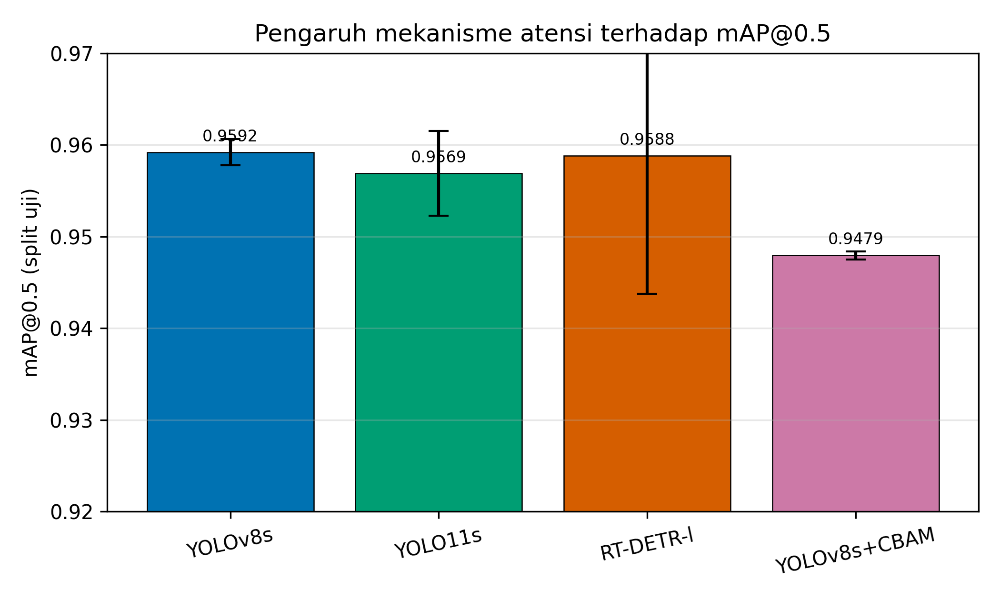
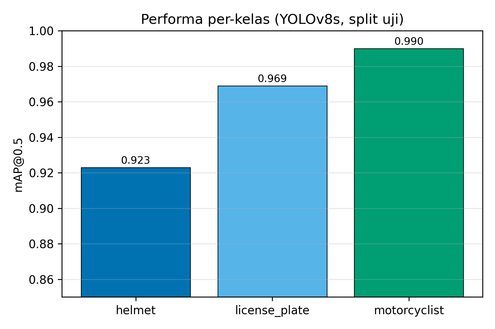
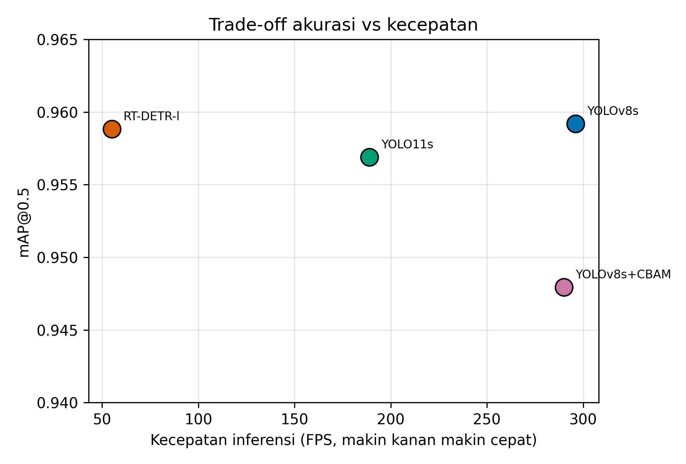
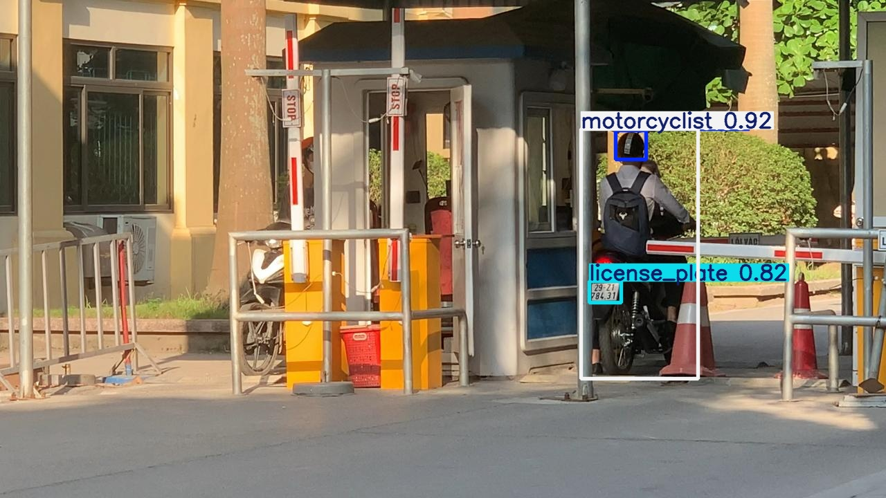

# Perbandingan Arsitektur Deteksi Objek Berbasis dan Tanpa Mekanisme Atensi untuk Deteksi Penggunaan Helm Pengendara Sepeda Motor

*Draf paper — format IMRaD, sitasi IEEE. Disusun dengan bantuan ARS academic-paper (mode full).*

---

## Abstrak (Bahasa Indonesia)

Penggunaan helm merupakan faktor protektif utama bagi pengendara sepeda motor, dan deteksi otomatis kepatuhannya melalui kamera lalu lintas dapat mendukung penegakan aturan keselamatan jalan. Mekanisme atensi (*attention*) telah menjadi tren dominan dalam visi komputer, namun manfaatnya untuk deteksi helm pada dataset berskala kecil belum banyak diuji secara terkontrol. Studi ini membandingkan empat arsitektur deteksi objek yang menempati spektrum penggunaan atensi: YOLOv8s (CNN murni, tanpa atensi), YOLO11s (atensi parsial melalui blok C2PSA), RT-DETR-l (transformer dengan atensi penuh), dan YOLOv8s+CBAM (CNN dengan modul atensi *channel*-*spatial*). Seluruh model dilatih pada dataset publik deteksi helm berisi 1.803 citra dengan tiga kelas (*helmet*, *license_plate*, *motorcyclist*), menggunakan protokol identik (*transfer learning* dari COCO, resolusi 1280, augmentasi sama) dan dievaluasi pada *split* uji dengan beberapa *seed* serta uji-t berpasangan untuk validitas statistik. Hasilnya, di bawah protokol pelatihan yang diseragamkan, tidak ada varian ber-atensi yang melampaui YOLOv8s baku: YOLOv8s mencapai mAP@0.5 tertinggi (0,9592 ± 0,0014) sekaligus kecepatan inferensi terbaik (~296 FPS). Uji-t berpasangan antar-*seed* menunjukkan penambahan modul CBAM menurunkan mAP@0.5 sebesar 0,0113 secara signifikan (t(2) = 10,9; p = 0,008), sedangkan YOLO11s dan RT-DETR-l tidak berbeda signifikan dari baseline. Karena baseline sudah mendekati 0,96 (efek langit-langit), daya statistik untuk mendeteksi perbaikan kecil terbatas, sehingga klaim kesetaraan—khususnya RT-DETR-l yang hanya diuji pada dua *seed*—perlu ditafsirkan hati-hati. Temuan ini menunjukkan bahwa pada dataset kecil yang relatif mudah dan di bawah hyperparameter yang ditata untuk YOLO, kompleksitas atensi tambahan tidak terbayar; arsitektur CNN sederhana tetap menjadi pilihan paling efisien untuk deteksi helm waktu-nyata pada kondisi ini.

**Kata kunci:** deteksi helm; deteksi objek; mekanisme atensi; YOLO; RT-DETR; CBAM; sepeda motor.

## Abstract (English)

Helmet use is the primary protective factor for motorcyclists, and automatic compliance detection through traffic cameras can support road-safety enforcement. Attention mechanisms have become a dominant trend in computer vision, yet their benefit for helmet detection on small-scale datasets remains under-examined in controlled settings. This study compares four object-detection architectures spanning the attention spectrum: YOLOv8s (pure CNN, no attention), YOLO11s (partial attention via C2PSA blocks), RT-DETR-l (a transformer with full attention), and YOLOv8s+CBAM (a CNN augmented with a channel-spatial attention module). All models were trained on a public helmet-detection dataset of 1,803 images with three classes (helmet, license_plate, motorcyclist) under an identical protocol (COCO transfer learning, 1280 resolution, matched augmentation) and evaluated on a held-out test split with several seeds and paired t-tests for statistical validity. Under the unified training protocol, no attention variant surpassed the plain YOLOv8s: it achieved the highest mAP@0.5 (0.9592 ± 0.0014) and the best inference speed (~296 FPS). A paired t-test across seeds showed that adding the CBAM module significantly reduced mAP@0.5 by 0.0113 (t(2) = 10.9; p = 0.008), whereas YOLO11s and RT-DETR-l did not differ significantly from the baseline. Because the baseline already approaches 0.96 (a ceiling effect), statistical power to detect small improvements is limited, so the equivalence claims—particularly for RT-DETR-l, tested on only two seeds—must be read with caution. The findings indicate that on a small, relatively easy dataset and under YOLO-tuned hyperparameters, the added complexity of attention does not pay off; a simple CNN architecture remains the most efficient choice for real-time helmet detection under these conditions.

**Keywords:** helmet detection; object detection; attention mechanism; YOLO; RT-DETR; CBAM; motorcycle.

---

## I. Pendahuluan

Sepeda motor menyumbang proporsi besar korban kecelakaan lalu lintas, khususnya di negara berkembang tempat moda ini mendominasi mobilitas harian. Helm adalah faktor protektif paling menentukan terhadap cedera kepala fatal, sehingga pemantauan kepatuhan penggunaan helm menjadi sasaran penting kebijakan keselamatan. Pengamatan manual tidak terskala untuk volume lalu lintas nyata: petugas tidak mungkin mengamati setiap simpang sepanjang waktu, dan survei sesaat memberi gambaran yang bias. Di sinilah deteksi objek otomatis dari rekaman kamera menawarkan jalan keluar yang dapat berjalan terus-menerus dan konsisten [1], [2].

Selama satu dekade terakhir, deteksi objek bergeser dari pendekatan dua-tahap yang akurat namun lambat ke detektor satu-tahap yang cepat, dengan keluarga YOLO sebagai standar de-facto untuk aplikasi waktu-nyata [5]. Secara paralel, mekanisme atensi yang lahir dari Transformer [10] dan diadaptasi ke citra melalui Vision Transformer [11] telah mengubah lanskap arsitektur. Detektor berbasis Transformer seperti DETR [8] dan turunan waktu-nyatanya RT-DETR [7] kini bersaing dengan CNN, sementara modul atensi ringan seperti Squeeze-and-Excitation [12] dan CBAM [9] menjadi cara populer menyisipkan atensi ke dalam *backbone* CNN yang sudah ada.

Tren ini memunculkan asumsi implisit bahwa menambahkan atensi cenderung meningkatkan performa. Asumsi tersebut beralasan pada *benchmark* berskala besar seperti COCO, tempat keragaman dan volume data memberi ruang bagi atensi untuk mempelajari ketergantungan jarak-jauh yang bermanfaat. Namun pada konteks praktis deteksi helm—yang sering memakai dataset berskala kecil, terkurasi, dan dengan jumlah kelas terbatas—belum jelas apakah kompleksitas atensi benar-benar terbayar. Banyak laporan membandingkan satu varian model tanpa kendali eksperimen yang ketat, tanpa pengulangan antar-*seed*, dan dengan protokol pelatihan yang berbeda-beda. Akibatnya, perbedaan performa yang dilaporkan bisa berasal dari hyperparameter, augmentasi, atau keberuntungan inisialisasi—bukan dari mekanisme atensi itu sendiri.

Studi ini menutup celah tersebut dengan satu pertanyaan riset terfokus: **apakah mekanisme atensi—baik parsial, transformer penuh, maupun modul CBAM—meningkatkan akurasi deteksi penggunaan helm pengendara motor dibanding CNN murni pada dataset skala kecil?** Untuk menjawabnya, kami menyusun perbandingan terkendali atas empat arsitektur yang sengaja dipilih agar menempati titik berbeda pada spektrum penggunaan atensi, dengan protokol pelatihan dan evaluasi yang seragam, serta pengulangan antar-*seed* untuk menilai signifikansi praktis.

Kontribusi utama paper ini:

1. **Perbandingan terkendali** empat arsitektur deteksi (YOLOv8s, YOLO11s, RT-DETR-l, YOLOv8s+CBAM) pada tugas deteksi helm dengan hyperparameter, data, dan augmentasi identik, sehingga selisih performa dapat diatribusikan ke faktor arsitektur, khususnya keberadaan dan jenis atensi.
2. **Evaluasi multi-*seed*** dengan pelaporan rata-rata ± simpangan baku, sehingga kesimpulan tidak rentan terhadap keberuntungan satu inisialisasi.
3. **Bukti empiris berlawanan intuisi**: pada dataset ini, tidak ada mekanisme atensi yang melampaui CNN murni, dan modul CBAM bahkan menurunkan akurasi secara konsisten. Kami menelusuri penyebabnya dan membahas implikasinya bagi praktik pemilihan model.

## II. Tinjauan Pustaka

### A. Deteksi penggunaan helm

Penelitian deteksi helm berkembang dari klasifikasi sederhana menuju pipeline yang mampu melacak motor antar-bingkai dan membedakan pengemudi dari penumpang. Siebert dan Lin [1] mendemonstrasikan deteksi penggunaan helm skala besar dari video lalu lintas Myanmar menggunakan pendekatan *deep learning* dengan detektor satu-tahap, dan merilis dataset beranotasi yang menjadi rujukan komunitas. Lin dkk. [2] memperluasnya dengan *multi-task learning* berbasis CNN yang melacak motor individual sekaligus meregistrasi penggunaan helm per-pengendara, sehingga mampu menangani kasus boncengan dan membedakan pengemudi dari penumpang.

Tantangan benchmark seperti AI City Challenge 2023 Track 5 [3] mendorong perhatian pada deteksi pelanggaran helm multi-kelas, termasuk pembedaan status helm pengemudi dan penumpang pertama serta kedua. Skema kelas yang rinci ini menyingkap masalah ketidakseimbangan kelas yang ekstrem, karena kategori seperti penumpang kedua tanpa helm sangat jarang muncul. Pada konteks penegakan, sejumlah pendekatan menggabungkan deteksi helm dengan lokalisasi plat nomor dan pengenalan karakter untuk identifikasi pelanggar [4], sering ditambah deteksi boncengan lebih dari dua orang.

### B. Detektor satu-tahap dan keluarga YOLO

Detektor satu-tahap memformulasikan deteksi sebagai regresi langsung *bounding box* dan kelas dalam satu lintasan jaringan, menukar sebagian akurasi dengan kecepatan tinggi [5], dan kesenjangan akurasi ini sebagian dipersempit oleh fungsi rugi seperti *focal loss* yang menangani ketidakseimbangan kelas pada deteksi padat [13]. Keluarga YOLO menjadi tulang punggung aplikasi waktu-nyata, dengan iterasi yang terus memperbaiki *backbone*, *neck*, strategi penugasan label, dan augmentasi. YOLOv8 mewakili generasi CNN yang matang tanpa modul atensi eksplisit; arsitekturnya mengandalkan blok konvolusi efisien dan *feature pyramid* untuk menangani objek multi-skala. YOLO11 memperkenalkan blok atensi posisional (C2PSA) ke dalam jalur fitur, menjadikannya titik tengah yang menarik pada spektrum atensi—sebuah CNN yang menambahkan *self-attention* terbatas tanpa berpindah sepenuhnya ke paradigma transformer.

### C. Mekanisme atensi dalam visi komputer

Atensi memungkinkan model menimbang ulang informasi secara selektif, menonjolkan bagian yang relevan dan menekan yang tidak. Transformer [10] memperkenalkan *self-attention* yang memodelkan ketergantungan global antar-elemen, dan Vision Transformer [11] membuktikan paradigma ini kompetitif untuk citra ketika data pelatihan cukup besar. Pada deteksi, DETR [8] memformulasikan deteksi sebagai prediksi himpunan dengan *encoder-decoder* Transformer dan menghapus komponen buatan-tangan seperti *anchor* dan *non-maximum suppression*. Kelemahan DETR—konvergensi lambat dan biaya komputasi tinggi—mendorong lahirnya RT-DETR [7] yang mengadaptasi ide tersebut menjadi waktu-nyata melalui *encoder* hibrida yang efisien. Arah lain memakai atensi pada tingkat *backbone*: Swin Transformer [15] memperkenalkan atensi berjendela hierarkis yang efisien sebagai *backbone* deteksi, sementara ViTDet [16] menunjukkan *backbone* ViT polos dapat dipakai untuk deteksi. Pendekatan-pendekatan ini umumnya unggul justru ketika data pelatihan berlimpah.

Pada sisi yang berbeda, modul atensi ringan menyisipkan atensi ke CNN tanpa mengganti arsitektur dasar. Squeeze-and-Excitation [12] memberi atensi antar-kanal dengan mempelajari bobot pentingnya setiap kanal fitur. CBAM [9] memperluasnya dengan menggabungkan atensi kanal dan atensi spasial secara berurutan, sehingga model dapat menekankan "apa" yang penting sekaligus "di mana". Modul-modul ini menarik karena murah, tidak menambah banyak parameter, dan mudah dipasang pada jaringan yang sudah ada. Namun efektivitasnya bergantung pada tugas dan skala data: pada dataset kecil, modul yang diinisialisasi acak harus belajar dari sinyal yang terbatas.

### D. Celah penelitian

Literatur deteksi helm cenderung melaporkan satu konfigurasi model dengan protokol yang berbeda-beda, sering tanpa pengulangan antar-*seed*, sehingga atribusi sebab-akibat ke mekanisme atensi menjadi lemah. Ketika sebuah studi melaporkan bahwa model ber-atensi mengungguli baseline, sulit memastikan apakah keunggulan itu berasal dari atensi atau dari perbedaan resolusi, augmentasi, jumlah epoch, atau inisialisasi. Studi ini mengisi celah tersebut melalui perbandingan terkendali dan berulang yang secara eksplisit memvariasikan keberadaan dan jenis atensi sebagai sumbu utama, sambil menahan seluruh faktor lain tetap konstan.

## III. Metodologi

### A. Dataset

Kami menggunakan dataset publik deteksi helm dari Roboflow Universe ("NCKH 2023 / Helmet Detection Project", versi 19, lisensi MIT). Dataset berisi 1.803 citra beranotasi format YOLO dengan tiga kelas: *helmet*, *license_plate*, dan *motorcyclist*. Pembagian data tetap digunakan sepanjang eksperimen agar tidak ada keacakan ulang antar-*run*: 1.563 citra latih, 140 validasi, dan 100 uji. Seluruh metrik akhir dihitung pada *split* uji yang tidak pernah dilihat selama pelatihan untuk menghindari kebocoran data. Anotasi mencakup tiga kelas yang secara langsung relevan untuk skenario penegakan: pengendara sebagai konteks, helm sebagai objek kepatuhan, dan plat nomor sebagai jangkar identifikasi.

### B. Arsitektur yang dibandingkan

Empat arsitektur dipilih agar menempati titik berbeda pada spektrum penggunaan atensi (Tabel I). Pemilihan ini disengaja: dari CNN tanpa atensi sama sekali, ke CNN dengan atensi parsial, ke transformer dengan atensi penuh, dan akhirnya intervensi atensi terkendali yang hanya menambahkan modul pada baseline.

**TABEL I. Empat arsitektur dan posisinya pada spektrum atensi.**

| Model | Paradigma | Mekanisme atensi | Parameter |
|---|---|---|---|
| YOLOv8s | CNN satu-tahap | Tidak ada (baseline) | ~11,17 jt |
| YOLO11s | CNN satu-tahap | Parsial (blok C2PSA) | ~9,4 jt |
| RT-DETR-l | Transformer | Penuh (*self-attention*) | ~32 jt |
| YOLOv8s+CBAM | CNN + modul atensi | Kanal + spasial (CBAM) | ~11,51 jt |

Varian YOLOv8s+CBAM merupakan arsitektur kustom yang menjadi inti eksperimen atensi terkendali. Tiga modul CBAM disisipkan pada keluaran tiga skala deteksi (P3, P4, dan P5) tepat sebelum kepala deteksi, sehingga model identik dengan YOLOv8s baku kecuali penambahan atensi tersebut. Penempatan pada ketiga skala memastikan atensi bekerja pada fitur kecil (P3, untuk objek seperti helm dan plat), menengah (P4), dan besar (P5). Penambahan ini hanya menaikkan jumlah parameter dari 11,17 juta menjadi 11,51 juta—sekitar 3%—menjadikannya intervensi yang ringan dan terisolasi sehingga setiap perubahan performa dapat dikaitkan langsung ke modul atensi.

### C. Protokol pelatihan

Untuk memastikan perbedaan performa dapat diatribusikan ke arsitektur, seluruh model dilatih dengan protokol identik menggunakan kerangka Ultralytics [6] di atas PyTorch dan satu GPU NVIDIA RTX 4090. Setiap model diinisialisasi dengan *transfer learning* dari bobot praterlatih COCO [14]; untuk varian CBAM, lapisan atensi diinisialisasi acak sementara sisanya mewarisi bobot COCO. Konfigurasi seragam meliputi resolusi masukan 1280 piksel, penentuan ukuran *batch* otomatis sesuai memori GPU, pemilihan *optimizer* otomatis, augmentasi yang sama (*mosaic*, penggeseran *HSV*, dan pencerminan horizontal), serta penghentian dini dengan kesabaran 25 epoch dari maksimum 100 epoch.

Resolusi tinggi 1280 piksel dipilih karena analisis awal menunjukkan kelas *helmet* dan *license_plate* berukuran kecil di dalam bingkai, sehingga resolusi rendah merugikan deteksinya. Reproducibility ditegakkan dengan mematok *seed* untuk pustaka *random*, NumPy, dan PyTorch dalam mode deterministik, serta menyimpan konfigurasi dan informasi lingkungan (versi pustaka, *seed*, dan perangkat) pada setiap *run*. Untuk validitas statistik, setiap model dilatih ulang pada beberapa *seed* (42, 0, dan 1) dan dilaporkan rata-rata ± simpangan baku pada *split* uji. RT-DETR-l hanya dijalankan pada dua *seed* karena biaya pelatihannya jauh lebih tinggi, sekitar 190 menit per *run* dibanding sekitar 26 menit untuk varian YOLO; keterbatasan ini dicatat secara eksplisit dan diperhitungkan saat menafsirkan variansinya.

### D. Metrik evaluasi

Metrik utama adalah mAP@0.5 dan mAP@[.5:.95] sesuai konvensi deteksi objek, dilengkapi *precision*, *recall*, dan kecepatan inferensi dalam *frame per second* (FPS). Karena pengukuran FPS pada *sweep* multi-*seed* terpengaruh beban GPU yang berjalan beruntun, angka FPS yang dilaporkan diambil dari *run* tunggal saat GPU senggang agar mencerminkan kecepatan sebenarnya. Pembedaan ini penting agar perbandingan kecepatan tidak menyesatkan akibat artefak pengukuran.

Untuk menilai signifikansi perbedaan akurasi, kami memasangkan hasil antar-model berdasarkan *seed* yang sama dan menerapkan **uji-t berpasangan** pada selisih mAP@0.5, dengan taraf nyata α = 0,05, serta melaporkan selang kepercayaan 95% bagi selisih rata-rata. Pemasangan berdasarkan *seed* mengendalikan variasi inisialisasi sehingga uji lebih sensitif terhadap efek arsitektur. Mengingat jumlah *seed* kecil (n = 3 untuk varian YOLO, n = 2 untuk RT-DETR-l), uji ini bersifat indikatif: ia dapat memastikan perbedaan yang konsisten, tetapi berdaya rendah untuk menolak kesetaraan—keterbatasan yang kami bahas secara eksplisit di Bagian VI.

## IV. Hasil

Tabel II merangkum performa keempat arsitektur pada *split* uji. YOLOv8s mencapai mAP@0.5 tertinggi sekaligus kecepatan inferensi terbaik. YOLO11s dan RT-DETR-l setara secara akurasi namun lebih lambat, sedangkan YOLOv8s+CBAM justru paling rendah pada mAP@0.5.

**TABEL II. Perbandingan performa pada split uji (rata-rata ± simpangan baku).**

| Model | n *seed* | mAP@0.5 | mAP@[.5:.95] | FPS |
|---|---|---|---|---|
| **YOLOv8s** | 3 | **0,9592 ± 0,0014** | 0,6862 ± 0,0046 | **~296** |
| YOLO11s | 3 | 0,9569 ± 0,0046 | **0,6898 ± 0,0030** | ~189 |
| RT-DETR-l | 2 | 0,9588 ± 0,0151 | 0,6764 ± 0,0205 | ~55 |
| YOLOv8s+CBAM | 3 | 0,9479 ± 0,0004 | 0,6810 ± 0,0045 | ~290 |

### A. Pengaruh mekanisme atensi

Sumbu utama studi—keberadaan dan jenis atensi—tidak menunjukkan keuntungan. Gambar 1 memvisualisasikan mAP@0.5 keempat model beserta simpangan baku antar-*seed*. YOLOv8s tanpa atensi memimpin. Uji-t berpasangan menegaskan bahwa baik YOLO11s (Δ = +0,0023; t(2) = 0,73; p = 0,54; 95% CI [−0,011; +0,016]) maupun RT-DETR-l (Δ = +0,0012; t(1) = 0,11; p = 0,93; 95% CI [−0,140; +0,142]) **tidak berbeda signifikan** dari baseline. Selang kepercayaan RT-DETR-l yang sangat lebar—akibat hanya dua *seed* dengan hasil berjauhan (0,9482 dan 0,9695)—menunjukkan estimasi yang tidak stabil; kesetaraannya karena itu lebih merupakan ketiadaan bukti perbedaan daripada bukti kesetaraan.

Berbeda dengan kedua model di atas, penambahan modul CBAM menurunkan mAP@0.5 sebesar 0,0113, dan penurunan ini **signifikan secara statistik** (uji-t berpasangan: t(2) = 10,9; p = 0,008; 95% CI penurunan [0,0068; 0,0157]). Konsistensi simpangan baku yang kecil pada kedua model (0,0014 untuk baseline, 0,0004 untuk varian CBAM) menegaskan bahwa penurunan ini stabil di seluruh inisialisasi yang diuji. Perlu ditekankan bahwa hasil ini berlaku di bawah protokol pelatihan yang ditata untuk YOLO; ia menunjukkan bahwa penyisipan CBAM merugikan *pada kondisi tersebut*, bukan bahwa atensi merugikan secara universal.

### B. Performa per-kelas

Pada baseline YOLOv8s, akurasi per-kelas menunjukkan pola yang konsisten dengan ukuran dan kekhasan objek (Gambar 2). Kelas *motorcyclist* paling mudah dideteksi (mAP@0.5 = 0,990) karena berukuran besar dan menonjol di bingkai. Kelas *license_plate* mengikuti (0,969) dengan bentuk persegi panjang yang khas. Kelas *helmet* paling menantang (0,923) karena ukurannya kecil, kemiripannya dengan objek lain di kepala pengendara seperti topi atau rambut, serta variasi warna dan sudut pandang. Pola ini menegaskan bahwa kelas *helmet*—yang justru paling relevan untuk tujuan aplikasi—adalah penentu utama ruang perbaikan, dan setiap upaya peningkatan sebaiknya difokuskan ke sana.

### C. Trade-off kecepatan

Perbedaan kecepatan jauh lebih besar daripada perbedaan akurasi (Gambar 3). RT-DETR-l berjalan pada sekitar 55 FPS, kira-kira lima kali lebih lambat daripada YOLOv8s yang mencapai sekitar 296 FPS, dan menuntut waktu pelatihan sekitar 190 menit per *run* dibanding sekitar 26 menit untuk YOLO. YOLO11s berada di tengah dengan sekitar 189 FPS, sedangkan varian CBAM nyaris sama cepat dengan baseline karena modul yang ditambahkan ringan. Ketika akurasi keempat model praktis setara, biaya komputasi transformer tidak terbayar pada tugas ini. Gambar 3 menempatkan YOLOv8s di pojok paling menguntungkan: akurasi tertinggi sekaligus kecepatan tertinggi.

### D. Analisis kualitatif

Gambar 4 menampilkan contoh keluaran deteksi YOLOv8s pada satu citra uji. Model mendeteksi pengendara, helm, dan plat nomor secara bersamaan dengan kotak pembatas yang rapat, menggambarkan kasus tipikal tempat ketiga kelas hadir dalam satu adegan. Inspeksi visual atas sampel uji menunjukkan bahwa kesalahan yang tersisa cenderung muncul pada helm berukuran sangat kecil atau terhalang sebagian, sejalan dengan temuan kuantitatif bahwa kelas *helmet* adalah yang paling sulit.

## V. Pembahasan

Temuan sentral studi ini berlawanan dengan intuisi umum bahwa atensi cenderung membantu: pada dataset deteksi helm berskala kecil, tidak ada mekanisme atensi yang melampaui CNN murni, dan modul CBAM bahkan merugikan. Tiga penjelasan yang saling melengkapi dapat menerangkan pola ini.

Pertama, **dataset relatif kecil dan mudah**. Dengan 1.563 citra latih dan baseline yang sudah mencapai sekitar 0,96 mAP@0.5, ruang perbaikan sangat sempit. Ketika sebuah model sederhana sudah mendekati batas atas yang dapat dicapai pada data ini, hampir tidak ada celah bagi mekanisme yang lebih kompleks untuk menunjukkan keunggulan. Mekanisme atensi—terutama transformer yang lapar data—membutuhkan volume dan keragaman besar untuk mempelajari pola ketergantungan yang berguna. Pada rezim data kecil, keunggulan teoritisnya tidak terwujud dan model justru menanggung beban kapasitas yang tidak terpakai.

Kedua, **lapisan atensi yang diinisialisasi acak dapat mengganggu fitur praterlatih**. Pada varian CBAM, sebagian besar bobot diwarisi dari COCO sementara modul atensi dimulai dari nol. Modul yang belum terlatih ini menyisipkan transformasi yang, pada awal pelatihan, mengganggu aliran fitur yang sudah matang dari *transfer learning*. Dengan data terbatas, tidak cukup sinyal gradien untuk memulihkan gangguan tersebut, apalagi melampaui baseline. Hasilnya adalah penurunan kecil namun konsisten yang teramati stabil di seluruh *seed*. Penjelasan ini sejalan dengan pengamatan umum bahwa modul tambahan paling bermanfaat ketika dilatih bersama dari awal pada data besar, bukan ditempelkan pada jaringan praterlatih dengan data terbatas.

Ketiga, **kompleksitas tidak gratis**. Atensi menambah parameter dan komputasi. Ketika tidak ada keuntungan akurasi, tambahan ini murni menjadi biaya. Konsekuensinya paling nyata pada RT-DETR-l yang lima kali lebih lambat tanpa imbalan mAP, tetapi juga berlaku konseptual pada CBAM yang menambah jalur komputasi pada setiap skala deteksi. Dalam pengaturan waktu-nyata tempat anggaran komputasi terbatas, biaya ini berarti penurunan jumlah bingkai yang dapat diproses per detik.

Temuan ini dapat ditempatkan dalam konteks literatur yang lebih luas. Keunggulan arsitektur transformer dan modul atensi paling konsisten dilaporkan pada *benchmark* berskala besar dengan keragaman tinggi. Pada tugas khusus dengan data terbatas, sejumlah studi menemukan bahwa CNN yang ditata baik tetap kompetitif atau unggul. Hasil kami menambah bukti pada arah tersebut khusus untuk domain deteksi helm, dan menggarisbawahi bahwa pemilihan arsitektur sebaiknya dipandu oleh karakteristik data dan anggaran komputasi, bukan oleh tren arsitektur semata.

Penting menegaskan batas klaim ini agar tidak terjadi *overgeneralisasi*. Studi ini **tidak** menyimpulkan bahwa atensi tidak berguna secara umum. Yang kami tunjukkan lebih sempit: di bawah satu protokol pelatihan yang ditata untuk YOLO, pada satu dataset kecil yang relatif mudah, dan dengan baseline yang sudah mendekati langit-langit, penambahan atensi tidak meningkatkan akurasi dan—pada kasus CBAM—justru menurunkannya. Kesetaraan YOLO11s dan RT-DETR-l adalah ketiadaan bukti perbedaan, bukan bukti kesetaraan; efek langit-langit menekan daya statistik sehingga manfaat kecil dari atensi, seandainya ada, sulit terdeteksi. Hipotesis tandingan yang masuk akal—bahwa model ber-atensi belum dilatih pada resep optimalnya—tidak dapat kami singkirkan dan justru menjadi agenda kerja lanjut. Dengan kata lain, temuan ini paling tepat dibaca sebagai peringatan praktis terhadap asumsi "menambahkan atensi pasti membantu", bukan sebagai vonis terhadap atensi itu sendiri.

Implikasi praktisnya, dalam ruang lingkup tersebut, jelas: untuk deteksi helm waktu-nyata pada data serupa, arsitektur CNN sederhana seperti YOLOv8s adalah pilihan paling rasional—akurasi tertinggi, paling ringan, dan tercepat. Temuan ini juga menjadi pengingat metodologis bahwa klaim keunggulan arsitektur harus diuji dalam kondisi terkendali dan berulang sebelum diadopsi. Tanpa pengulangan antar-*seed*, selisih kecil seperti yang teramati di sini mudah disalahartikan sebagai keunggulan nyata padahal berada dalam rentang variasi acak.

## VI. Ancaman terhadap Validitas dan Keterbatasan

Studi ini memiliki beberapa keterbatasan yang membatasi generalisasi temuan. Pertama, evaluasi terbatas pada **satu dataset yang relatif bersih**; generalisasi ke kondisi nyata—rekaman CCTV jalan dengan oklusi, gerak cepat, pencahayaan buruk, dan kepadatan tinggi—belum diuji. Boleh jadi pada data yang lebih menantang, kemampuan atensi memodelkan konteks justru menjadi berguna. Kedua, **RT-DETR-l hanya dijalankan pada dua *seed*** karena biaya komputasi, sehingga estimasi variansinya kurang presisi dan kesimpulan kesetaraannya perlu ditafsirkan dengan hati-hati. Ketiga, perbandingan **bukan size-matched**: RT-DETR-l (~32 juta parameter) jauh lebih besar daripada varian YOLO-s (~9–11 juta), sehingga hasilnya mencerminkan perbandingan arsitektur standar, bukan kapasitas setara; perbandingan yang menyamakan jumlah parameter dapat memberi gambaran berbeda. Keempat, hyperparameter diseragamkan dan tidak di-*tuning* khusus per-arsitektur, padahal transformer dan CNN mungkin menuntut resep pelatihan berbeda untuk mencapai potensi puncaknya; akibatnya, hasil model ber-atensi mungkin merupakan batas bawah, bukan potensi sebenarnya. Kelima, **efek langit-langit menekan daya statistik**: dengan baseline sudah ~0,96, ruang perbaikan sempit dan jumlah *seed* kecil (n = 2–3), sehingga uji-t berdaya rendah untuk mendeteksi perbaikan kecil. Konsekuensinya, klaim kesetaraan (YOLO11s, RT-DETR-l) harus dibaca sebagai ketiadaan bukti perbedaan, bukan bukti kesetaraan; menyimpulkan "atensi tidak membantu" secara mutlak akan menjadi lompatan dari *absence of evidence* ke *evidence of absence*. Keenam, pengukuran FPS pada *sweep* multi-*seed* terpengaruh beban GPU; angka kecepatan diambil dari *run* tunggal untuk memitigasi bias ini, namun tetap merupakan estimasi pada satu konfigurasi perangkat keras.

## VII. Kesimpulan dan Saran

Kami membandingkan empat arsitektur deteksi objek yang menempati spektrum penggunaan atensi untuk deteksi penggunaan helm pengendara sepeda motor, di bawah protokol pelatihan dan evaluasi yang identik dan berulang. Di bawah protokol yang ditata untuk YOLO dan pada satu dataset kecil yang relatif mudah, tidak ada mekanisme atensi—parsial, transformer penuh, maupun modul CBAM—yang melampaui YOLOv8s CNN murni. YOLOv8s memberi akurasi tertinggi sekaligus kecepatan terbaik, sementara penambahan CBAM menurunkan mAP@0.5 secara signifikan (uji-t berpasangan, p = 0,008); kesetaraan YOLO11s dan RT-DETR-l ditafsirkan sebagai ketiadaan bukti perbedaan, bukan bukti kesetaraan, mengingat efek langit-langit. Dalam ruang lingkup ini, kompleksitas atensi tidak terbayar—sebuah peringatan praktis terhadap asumsi bahwa menambahkan atensi pasti membantu, bukan vonis umum atas mekanisme atensi.

Saran kerja lanjut mengikuti langsung dari keterbatasan di atas. Pertama, menguji generalisasi pada dataset yang lebih besar, beragam, dan menantang, termasuk rekaman CCTV nyata dengan kondisi sulit. Kedua, mengevaluasi atensi dalam rezim data besar tempat keunggulannya berpeluang muncul, serta dengan pelatihan dari awal alih-alih hanya menempelkan modul pada jaringan praterlatih. Ketiga, mengeksplorasi pendekatan *two-stage*—deteksi motor lalu klasifikasi helm—dan integrasi deteksi plat nomor untuk skenario penegakan. Keempat, melakukan perbandingan *size-matched* dan *fine-tuning* hyperparameter khusus per-arsitektur agar setiap model diuji pada kondisi terbaiknya.

---

## Pernyataan

**Ketersediaan Data (Data Availability).** Dataset bersifat publik melalui Roboflow Universe ("NCKH 2023 / Helmet Detection Project" v19, lisensi MIT). Skrip pelatihan, konfigurasi, dan notebook eksperimen tersedia dalam repositori riset penulis.

**Pernyataan Etika (Ethics).** Studi menggunakan dataset publik berlisensi terbuka tanpa data pribadi yang dapat diidentifikasi secara langsung di luar konteks lalu lintas publik; tidak melibatkan subjek manusia maupun eksperimen yang memerlukan persetujuan etik.

**Kontribusi Penulis (CRediT).** Konseptualisasi, metodologi, perangkat lunak, analisis, dan penulisan naskah: penulis. (Sesuaikan dengan daftar penulis sebenarnya.)

**Konflik Kepentingan (Conflict of Interest).** Penulis menyatakan tidak ada konflik kepentingan.

**Pendanaan (Funding).** Tidak ada pendanaan khusus yang dilaporkan untuk studi ini.

**Pernyataan Penggunaan AI (AI Disclosure).** Penyusunan eksperimen, analisis, dan penulisan naskah ini dibantu oleh alat berbasis AI (Claude Code beserta skill Academic Research Skills). Seluruh keputusan metodologis, verifikasi hasil numerik, dan tanggung jawab akhir atas isi berada pada penulis. Sumber rujukan diverifikasi keberadaannya secara independen.

---

## Referensi

[1] F. W. Siebert and H. Lin, "Detecting motorcycle helmet use with deep learning," *Accident Analysis & Prevention*, vol. 134, p. 105319, 2020.

[2] H. Lin, J. D. Deng, D. Albers, and F. W. Siebert, "Helmet use detection of tracked motorcycles using CNN-based multi-task learning," *IEEE Access*, vol. 8, pp. 162073–162084, 2020.

[3] M. Naphade et al., "The 7th AI City Challenge," in *Proc. IEEE/CVF Conf. Computer Vision and Pattern Recognition Workshops (CVPRW)*, 2023.

[4] W. Jia et al., "Real-time automatic helmet detection of motorcyclists in urban traffic using improved YOLOv5 detector," *IET Image Processing*, vol. 15, no. 14, pp. 3623–3637, 2021.

[5] J. Redmon, S. Divvala, R. Girshick, and A. Farhadi, "You only look once: Unified, real-time object detection," in *Proc. IEEE Conf. Computer Vision and Pattern Recognition (CVPR)*, 2016, pp. 779–788.

[6] G. Jocher, A. Chaurasia, and J. Qiu, "Ultralytics YOLO," 2023. [Online]. Available: https://github.com/ultralytics/ultralytics

[7] Y. Zhao et al., "DETRs beat YOLOs on real-time object detection," in *Proc. IEEE/CVF Conf. Computer Vision and Pattern Recognition (CVPR)*, 2024.

[8] N. Carion, F. Massa, G. Synnaeve, N. Usunier, A. Kirillov, and S. Zagoruyko, "End-to-end object detection with transformers," in *Proc. European Conf. Computer Vision (ECCV)*, 2020, pp. 213–229.

[9] S. Woo, J. Park, J.-Y. Lee, and I. S. Kweon, "CBAM: Convolutional block attention module," in *Proc. European Conf. Computer Vision (ECCV)*, 2018, pp. 3–19.

[10] A. Vaswani et al., "Attention is all you need," in *Advances in Neural Information Processing Systems (NeurIPS)*, 2017, pp. 5998–6008.

[11] A. Dosovitskiy et al., "An image is worth 16x16 words: Transformers for image recognition at scale," in *Proc. Int. Conf. Learning Representations (ICLR)*, 2021.

[12] J. Hu, L. Shen, and G. Sun, "Squeeze-and-excitation networks," in *Proc. IEEE Conf. Computer Vision and Pattern Recognition (CVPR)*, 2018, pp. 7132–7141.

[13] T.-Y. Lin, P. Goyal, R. Girshick, K. He, and P. Dollár, "Focal loss for dense object detection," in *Proc. IEEE Int. Conf. Computer Vision (ICCV)*, 2017, pp. 2980–2988.

[14] T.-Y. Lin et al., "Microsoft COCO: Common objects in context," in *Proc. European Conf. Computer Vision (ECCV)*, 2014, pp. 740–755.

[15] Z. Liu et al., "Swin Transformer: Hierarchical vision transformer using shifted windows," in *Proc. IEEE/CVF Int. Conf. Computer Vision (ICCV)*, 2021, pp. 10012–10022.

[16] Y. Li, H. Mao, R. Girshick, and K. He, "Exploring plain vision transformer backbones for object detection," in *Proc. European Conf. Computer Vision (ECCV)*, 2022, pp. 280–296.
